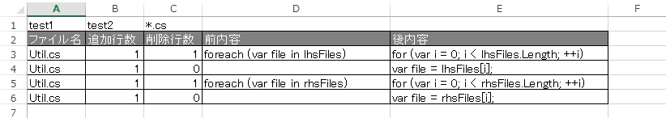

# DiffDetail

　ちょっとC#のソースファイルの修正差分(diff)行数を数える必要があったので作りました。
　C#形式のコメントや空行は読み飛ばしてディレクトリの中のソースコード同士を比較します。

　カスタマイズすることを前提に作っているので、比較や読み飛ばしなどのロジックは簡単に追加できるようになっています。

## 開発環境

　VisualStudio 2013 + C# + .NET Framework 4.5

## 使い方

    DiffDetail 比較元ディレクトリ 比較先ディレクトリ [比較するファイル名のパターン]

## 出力形式

コンソールにCSVで下記のように出力されますので適当にリダイレクトしてください。

    比較元ディレクトリ,比較先ディレクトリ
    ファイル名,追加行数,削除行数,前内容,後内容
    …
    …
    …

## 出力例

